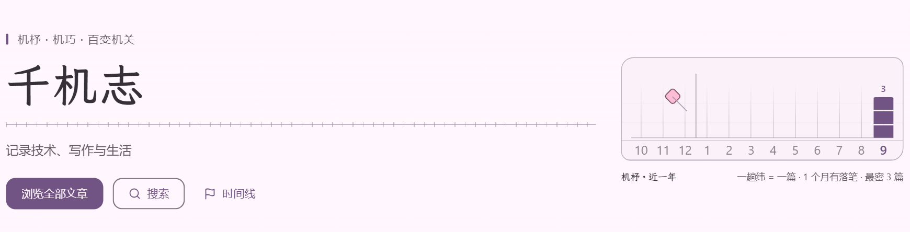
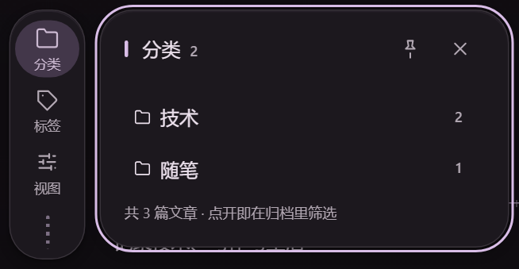
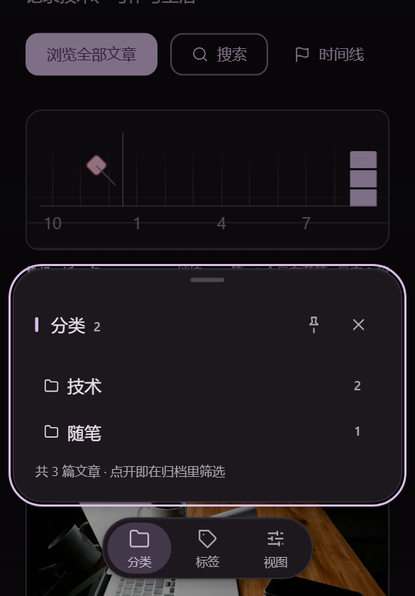
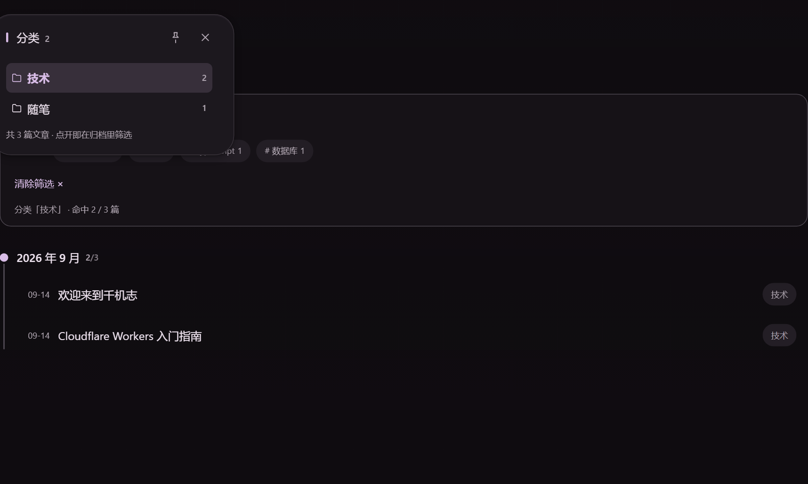

# 千机志 · jyuanblog

一个自己写完全部三端的个人博客：**Cloudflare Pages + Workers + D1 + Astro + Vue 3**。
访客前台是纯静态的，出厂配色在构建期算好直出，默认访客首屏只下载 **1.7 KB gzip 的 JS**。

- 线上站点：<https://jyuanblog.cc.cd>
- 本仓库：**访客前台**（Astro）。后端 Worker 与管理后台（Vue）在私有仓库，
  但它们的质量门禁跑在同一条 CI 里（见[质量门禁](#质量门禁)）。



---

## 目录

- [为什么这么设计](#为什么这么设计)
- [架构](#架构)
- [界面与设计系统](#界面与设计系统)
- [质量门禁](#质量门禁)
- [数字](#数字)
- [快速开始](#快速开始)
- [工程细节](#工程细节) —— 设计系统 / 动效 / 性能契约 / 账号与评论 / 环境变量 / 已知坑 / 部署与安全头
- [已知不足](#已知不足)

## 为什么这么设计

三个决定定义了这个项目，其余都是它们的推论：

1. **静态优先，而不是 SSR。** 文章数据在**构建期**从 Worker API 拉取并固化进 HTML。
   代价是发新文章要触发一次重建；换来的是没有运行时渲染层、没有缓存穿透、
   首屏字节里没有一个字节的框架水合代码。评论、播放计数这类真动态的部分
   单独做成按需水合的岛，其余保持静态。
2. **规范要能测。** 这个项目大量依赖"规范要求的数值恰好成立"——阅读列 840–1040dp、
   按钮与 chip 的形状不能互换、滚动入场每张卡片的 `animation-range` 必须互不相同。
   这些都能靠肉眼"看着还行"蒙过去，被后续改动破坏时也不会报错，因为
   **CSS 的失败是静默的**。所以我把观感固化成 92 条断言，用无头浏览器量真实计算值。
3. **母题要来自内容本身。** 站名"千机志"取机杼、机巧之意，于是首页那块发布节奏图
   不是柱状图，而是**织机上的布**：一格一个月，一趟纬线代表一篇文章，
   没发布的月份是"上了机还没织"的经线。全部由 CSS 绘制，不加载一张装饰图。

## 架构

```
访客侧（本仓库，Astro SSG）                管理侧（私有：Vue 3 + Element Plus）
  /            静态首页 + 发布节奏板         /admin/*  仪表板 / 文章 / 评论 / 音乐
  /blog/:slug  静态文章 + TOC                ↑ 构建期被并入同一个 Pages 项目的 dist/admin/
  /archives    静态归档（含分类/标签筛选）
  /search      Pagefind 全文检索（零后端）
  /timeline    静态时间线
  /rss.xml /atom.xml /llms.txt /llms-full.txt /sitemap.xml
                        所有动态数据 ↓
                 /api/*  Cloudflare Worker + D1（SQLite）
```

| 层 | 选型 | 为什么 |
|---|---|---|
| 托管 | Cloudflare Pages（静态）+ Workers（只挂 `/api/*`） | 美术改动走"构建 → Pages"，边缘节点不参与渲染；Free 档 10ms CPU 撑不起运行时 OG 生成，所以 OG 在构建期出 |
| 数据 | D1（SQLite）+ 构建期快照 | 文章读取全在构建期完成，运行时只有评论 / 计数 / 登录走 API |
| 前台 | Astro 7 + 少量 Svelte 岛 | 岛只有三处：显示设置、评论、音乐。其余零 JS |
| 后台 | Vue 3 + Element Plus，`base=/admin/` | 保留既有管理端，构建产物并入前台同一个部署单元 |
| 搜索 | Pagefind 构建期索引 | 不引入 Algolia / Meilisearch 这类外部依赖与费用 |

**安全边界**（实现在私有仓库，但每条都有 CI 用例压着）：

- 响应头由构建脚本生成 `_headers`。`script-src` 用**内联脚本的 sha256 哈希**，
  不是 `'unsafe-inline'`——哈希在构建期从最终产物现算，命中 0 条时构建直接失败。
  `style-src` 保留了 `'unsafe-inline'`（关键 CSS 内联直出是性能契约的一部分），
  这是写进注释的取舍，不是漏掉的。
- HSTS、COOP、CORP、`X-Content-Type-Options`、`Permissions-Policy` 全量下发；
  后台单独收紧到 `script-src 'self'`，代价是拦掉 Cloudflare 自动注入的分析 beacon——
  登录页是输入密码的地方，不该让第三方 CDN 脚本在此执行。
- 访客会话与管理端会话用**不同的存储键**，避免"注册访客账号"与"登录后台"共享状态。
- 公开评论接口不返回邮箱；署名一律以账号为准，前端连昵称都不发。
- 跨仓 CI 用**只读 Deploy Key**而不是 PAT：PAT 会把账号权限带进 CI，
  deploy key 只能读那一个仓库。

## 界面与设计系统



- **143 个设计令牌**分两层：`--mc-*` 是 HCT 引擎按"色相 + 风格 + 明暗"算出的 51 个
  M3 角色；语义层（`--primary` / `--surface` / `--outline`…）映射到它们，
  并带 `oklch()` 回退，保证引擎未介入时样式依然可用。访客换色相时，
  站点母题（织线、纸鸢、玻璃底色）全部跟着派生，不引入任何新色值。
- **三档响应式**，按交互方式分而不是按宽度堆：

  | 视口 | 悬浮栏 | 版心 |
  |---|---|---|
  | < 768px | 贴底药丸 + 悬浮玻璃卡（不压住图标条，可直接换分区） | 单列 |
  | 768–1279px | 正文左侧竖条，面板向右展开成浮层 | 1200 |
  | ≥ 1280px | 同上，但图标条占栅格一格 | 1280，主列 840 是**不变量** |

  主列 840 是反推出来的：`64(图标条) + 24 + 840(主列) + 24 + 280(部件列) + 48 = 1280`。
  早先版本在 1200px 就摆三列，主列被压到 760——加了侧栏反而把阅读体验弄差，
  而 CSS 不会报错。现在这条有断言守着。
- **材质**：悬浮栏是半透明毛玻璃（`backdrop-filter`），分两档——图标条 74% + blur 20，
  压在正文上的面板 86% + blur 24。两条兜底都退回实底：
  `@supports not (backdrop-filter)` 与 `prefers-reduced-transparency: reduce`
  （后者不是假想分支：Windows 关掉「透明效果」就会命中，所以两个方向各有一条断言）。
  顶栏与设置面板仍是实底——正文从它们底下滚过时不许透出。
- **无障碍**：触控目标 ≥ 48dp、`env(safe-area-inset-*)`、skip-link、
  面板焦点陷阱 + Esc 归还焦点、`aria-current` 标记所在位置、正文对比度 ≥ 4.5:1 契约。
  标签颜色来自后台数据、亮度不可控，因此渲染前既过协议白名单（防 CSS 注入），
  又用 `color-mix()` 向当前主题的正文色拉 35%——暗色下不会出现 `#ffd` 压 `#1a1a1a`。
- **品牌字体**：霞鹜文楷（OFL）在构建期用 HarfBuzz WASM 按 dist 里**真正出现的字符**
  切子集，两档字重共 237 KB / 555 字形。门禁 `fonts:check` 卡 400 KB 预算、
  检测字符集指纹是否陈旧，并禁止 TTF/OTF/TTC 与外链字体 CDN 进入产物。



## 质量门禁

一条 GitHub Actions 流水线跑三个仓库，约 1m50s，全绿才合并。

| 门禁 | 量什么 |
|---|---|
| `verify:visual`（92 条） | 无头 Edge + CDP 量**真实计算值**：形状契约、版心不变量、每张卡片的 `animation-range` 是否互不相同、玻璃正反两向、三档形态、展开面板不许挤窄正文、CSP 违规与页面异常 |
| 后端安全回归（47 条，私有仓） | 限流分档、防用户名枚举、令牌不可互用、提权防护、评论身份不可伪造、封禁立即生效 |
| `verify:exports` | `llms.txt` / `llms-full.txt` 里出现的每个 slug 都必须在公开列表内（**草稿泄露守卫**）；`_redirects` 不许留命名段占位符，且首页链到的每个筛选值都要有对应 301 |
| `tokens:check` | 后台令牌必须是前台真源的逐字镜像，防漂移 |
| `fonts:check` | 字体预算、字符集指纹陈旧检测、禁止未子集化的字体入产物 |

这套门禁拦下来的都是**不会报错**的真问题，举三个：

1. 暗色下每段代码是一块刺眼的白板——因为 `.prose pre` 直接用了 M3 的**相对**角色
   `inverse-*`，它在暗色下自动翻成近白。修法是把代码配色钉成不翻转的绝对值。
2. 侧栏被推到整篇正文底下——CSS Grid 的**稀疏自动摆放**会把"列变窄"的那一项
   行号 +1。两边行号钉死才修掉。
3. 玻璃断言在本地全绿、线上像没生效——这台机器的 Windows 关了「透明效果」，
   Chromium 报 `prefers-reduced-transparency: reduce`，量到的其实是兜底分支。
   现在测试显式钉住媒体条件。

还有一类是**跨环境行为不一致**：Cloudflare Pages 生产环境不会把命名段替换进查询串
（`/categories/:slug → /archives?category=:slug` 线上跳成字面量 `:slug`），
而本地 `wrangler pages dev` 会正确替换——本地 curl 自检骗得过，只有真上线才露出来。
现在带 slug 的重定向由构建脚本按真实清单逐条生成，占位符本身被门禁禁止。



## 数字

首页（默认访客，构建产物实测，gzip）：

| | |
|---|---|
| HTML | 13.0 KB |
| CSS | 10.2 KB |
| JS（`<script>` 立即加载） | **1.7 KB** |
| JS（含全部岛水合完成） | 5.9 KB |
| 色彩引擎 HCT | 23.9 KB，**只在访客真的改配色时**动态加载 |
| 品牌字体子集 | 237 KB（两个 woff2，555 字形） |

仓库规模：`src/` 约 9.3k 行、50 个文件、9 个页面路由 + 5 个内容端点、
6 个构建脚本、143 个设计令牌、92 条观感断言。

## 快速开始

```bash
npm install

# 后端需先起来（另开一个终端；私有仓库）
#   cd ../jyuanblog-worker && npx wrangler dev --port 8787

npm run dev          # http://localhost:4321
npm run build        # astro build → 字体子集 → pagefind 索引 → 并入后台 + 生成 _headers/_redirects
npm run check        # astro check（类型检查）
npm run verify:visual -- http://127.0.0.1:8790   # 观感回归，需本机 Edge/Chrome
```

`astro.config.mjs` 已把 `/api` 代理到本地 Worker，因此客户端用相对路径即可，
本地不需要 CORS 白名单。搜索只在构建产物里可用（Pagefind 索引是构建期产物）。

---

## 工程细节

### 设计系统

令牌定义在 `src/styles/variables.css`，两层结构：

1. `--mc-*`：由 HCT 引擎按"色相 + 风格 + 规范 + 明暗"算出的 51 个 M3 角色。
2. 语义层：`--primary` / `--surface` / `--outline` 等，映射到 `--mc-*`，
   并带 `oklch` 回退公式，保证引擎未介入时样式依然可用。

**形状契约**（改样式前请先读）：

| 元素 | 圆角 | 令牌 |
|---|---|---|
| 按钮、输入框 | 12px | `--shape-corner-m` |
| 卡片 | 16px | `--shape-corner-l` |
| chip、图标按钮 | 全圆 | `--shape-corner-full` |
| 浮层 / 对话框 / 搜索栏 | 28px | `--shape-corner-xl` |

> ⚠️ **按钮与 chip 的形状不能互换**。早期版本把两者写反了：按钮是胶囊
> （chip 的形状）、chip 是 8px 小圆角（按钮的形状），结果每个按钮看起来
> 都像个标签，反而削弱了"这可点"的暗示。判断依据是 M3E 的语义——
> **核心控件用 12px，标签用全圆**。这条有测试覆盖（`verify:visual`）。

**版心契约**：正文阅读列是 `--m3e-reading-max`，规范要求在 Extra-large
（≥1280px）下把正文约束在 **840–1040dp** 内、两侧留白。本项目取区间下界
**840px**：同一像素宽度下中文能排的字数约为西文两倍，840px / 16px 已是
52 个汉字一行。`--m3e-measure`（`.prose` 的行宽上限）直接引用它——
两者一旦分开取值，宽屏上正文会比标题窄一截，右半边空出一条竖向死区。

文章页侧栏 TOC 的断点（`1200px`）与版心宽度（`1120px`）也是从这个不变量
**反推**的：`840 + 240 + 24 = 1104`。若沿用更早的 `1100px` 断点 + `1080px` 版心，
一加侧栏正文列就只剩 816px，跌破 840px 下界——加侧栏反而把阅读体验弄差，
这类回归不会报错，只能靠断言拦住。

**对比度契约**：正文 ≥ 4.5:1，大字与边界 ≥ 3:1；`--primary` 只能配 `--on-primary`，
`--primary-container` 只能配 `--on-primary-container`。

### 目录结构

```
src/
├── config/site.ts          站点配置单一真源（标题/导航/主题默认值/API 地址）
├── lib/
│   ├── mc-utils.ts         Material 3 动态配色引擎（HCT，移植自 Shirone）
│   ├── vendor/material-color.mjs  预打包的官方色彩库（Apache-2.0，见 NOTICE.md 与"已知坑"）
│   ├── theme.ts            主题运行时（轻量层，不含引擎）
│   ├── theme-engine.ts     引擎入口（唯一静态 import mc-utils 的模块，只能动态加载）
│   ├── api.ts              构建期从 Worker API 拉数据（带备忘录，同页多处复用一次请求）
│   └── format.ts           Markdown 渲染 / TOC / 阅读时长 / 日期 / safeColor
├── styles/
│   ├── variables.css       M3E 设计令牌（色彩角色/形状/间距/动效/排版/层级）
│   └── main.css            基础样式 + M3 组件原语 + 毛玻璃 + 母题 + Markdown 排版
├── components/
│   ├── TopAppBar / Footer / ArticleCard / Icon
│   ├── SideDock.astro      常驻悬浮栏「机杼匣」（分类/标签/音乐/视图）
│   ├── WidgetSidebar.astro + widgets/   名片、站点数据、发布日历
│   ├── SettingsPanel.svelte  访客显示设置（配色引擎按需动态 import）
│   └── Comments.svelte        评论区（客户端拉 API）
├── layouts/BaseLayout.astro
└── pages/                  9 个页面路由 + rss/atom/llms/llms-full/sitemap 端点
scripts/                    字体子集与预算门禁、后台合并 + _headers/_redirects 生成、
                            观感回归、导出守卫
```

### 动效

动效令牌在 `variables.css`，遵循 M3 的完整时长阶梯
（`--m3e-duration-short1` … `--m3e-duration-extra-long4`，50ms–1000ms），
外加 `--m3e-duration-short/medium/long` 三个语义别名。
缓动里 `emphasized` 与 `standard` 的贝塞尔值相同**不是笔误** —— M3 的 emphasized
是一段两段式路径，单条 `cubic-bezier` 表达不了，material-web 的 Web 实现同样用
standard 近似它；真正拉开观感的是 `emphasized-decelerate`（进场）与
`emphasized-accelerate`（离场）。

**页面过渡是纯 CSS 的**，没有引入 Swup 之类的路由库：
`@view-transition { navigation: auto }` 让浏览器在跨文档导航时自动做过渡，
`::view-transition-old/new(root)` 负责进出动画，顶栏与悬浮栏分别用
`view-transition-name: topbar` / `dock` 钉住、不跟着淡入淡出。
代价是必须同源且浏览器支持；不支持时就是一次普通跳转，没有任何降级成本。
访客手动关闭动效时会 `view-transition-name: none` 一并关掉它。

已实现的动效（**全部零 JS**，不挂滚动监听）：

| 效果 | 实现 | 位置 |
|---|---|---|
| 页面切换淡化移位 | `@view-transition` + `m3-page-in/out` | `main.css` |
| 卡片滚入浮现 | `animation-timeline: view()`，`entry 0%→45%` | `.m3-reveal` |
| 卡片错落入场 | 逐张微调 `animation-range` | `.m3-stagger` |
| 顶栏随滚动抬起 | `animation-timeline: scroll(root block)`，`0→96px` | `.topbar` |
| 按钮/图标按钮状态层 | `::after` 叠 `currentColor`，hover 8% / focus 10% / press 12% | `.m3-button`、`.m3-icon-btn` |
| 按钮形状变形 | `:active` 时圆角 12px → 8px | `.m3-button` |
| 悬浮栏展开 / 换分区 | `transform` + `opacity`，逐格错落；**绝不动画 blur 半径** | `SideDock.astro` |
| 壁纸缓慢呼吸 | 18s 环境动效，仅横幅模式 | `body.has-wallpaper::before` |
| 评论加载骨架屏 | 结构与真实评论一致，避免内容到位时布局跳动 | `Comments.svelte` |

六条必须遵守的规则（每条都对应一次真实踩坑）：

1. **`animation-timeline` 必须用长写属性声明。** 写成简写
   `animation: linear both m3-rise-in view()` 时，浏览器解析不了 `view()` 会
   **整条声明作废** —— `animation-name` 静默回退成 `none`，动画完全不跑却不报错；
   而相邻的 `animation-range` 是独立声明仍然生效，排查时极具迷惑性。
   同时必须写 `animation-duration: auto`，写 `0s` 会被当成零时长动画瞬间跑完。
2. **减少动效不能只压时长。** 滚动驱动动画由滚动进度而非 `animation-duration` 驱动，
   只把时长设成 `0.01ms` 关不掉它。`variables.css` 的 reduced-motion 块里额外有
   `animation-timeline: none !important` 把它退回文档时间轴，才能真正停掉。
3. **入场元素默认必须是可见的**，绝不能预设 `opacity: 0`。滚动动效最典型的翻车
   就是初始状态透明、动画因浏览器不支持或用户关了动效而没跑，内容永久消失。
   这里的状态是"可见"，动画只负责把它演进来，且外层有
   `@supports (animation-timeline: view())` + `prefers-reduced-motion: no-preference`
   + `:root:not(.motion-reduced)` 三重守卫。
4. **错落要用 `animation-range` 的微调，不能用 `animation-delay`。** 滚动驱动动画的
   时间轴是滚动进度而非时钟，`animation-delay` 会被忽略。
   做法是逐张把入场区间起点往后推 2%：`entry -2%/0%/2%/4%/6%`。
5. **错落选择器必须匹配元素自己**，不是它的后代。`ArticleCard` 的根元素同时是
   `.m3-stagger` 的直接子元素**和** `.m3-reveal` 的载体，所以选择器是
   `.m3-stagger > .m3-reveal:nth-child(n)`；写成 `> *:nth-child(n) .m3-reveal`
   （后代组合器）会**一条都匹配不上**，错落静默失效、页面上看不出任何异常。
   `verify:visual` 里有一条断言专门比对"每张卡片的 range 是否互不相同"来兜住它。
6. **`animation-range` 里 `0%` 可以被省略**（`entry entry 45%` 等价于
   `entry 0% entry 45%`），构建工具会顺手压掉它，属正常现象、不是 bug。

### 性能契约：默认访客零 JS 负担

这是本项目最重要的一条设计约束，改动时请勿破坏：

- **出厂配色在构建期算好**，直接以 `<style id="jyuanblog-theme">` 内联进 HTML。
  默认访客**不下载任何配色代码**就有正确颜色。
- 访客改配色时，引擎（101 KB raw / 23.9 KB gzip）才通过**动态 import** 加载，
  算出的 CSS 缓存进 `localStorage`；刷新时内联脚本直接注入缓存，
  **不再次加载引擎、也不闪烁**。
- 因此 `theme.ts` 绝不能 import `mc-utils.ts`——一旦引入，引擎会与该模块打进
  同一个 chunk，懒加载失效。需要引擎请走 `theme-engine.ts`。

可用这条命令自查（应全部为 0 / false）：

```bash
node -e "const h=require('fs').readFileSync('dist/index.html','utf8');
console.log('外部脚本数:', (h.match(/<script[^>]*src=/g)||[]).length,
            '| 含引擎:', h.includes('SchemeTonalSpot'))"
```

### 账号与评论

前台有两个轻量页面：`/login` 与 `/register`，表单是 Svelte 岛（`client:load`），
页面壳仍是静态 HTML。会话存 `localStorage`，键为 `jyuanblog:user-token` /
`jyuanblog:user-profile`（见 `src/lib/session.ts`）。

> ⚠️ **前台与后台用不同的存储键**。后台（Vue）用 `jyuanblog_token`。
> 刻意不共用：否则"注册一个访客账号"与"登录管理后台"会共享同一份会话状态，
> 容易造成权限边界上的误解。

评论区（`Comments.svelte`）的行为：

- **未登录：没有表单，只有登录引导**（`/login` 与 `/register` 两个按钮）。
  这是服务端渲染出来的，禁用 JS 或首屏未水合时也能看到 —— 不会出现
  "能填但提交了才被拒"的挫败感。
- 已登录：**隐藏昵称输入框**，提交时不发送作者名 —— 后端一律以账号名为准。
  这里不发是为了让"署名不可伪造"这件事在代码里一眼可见，而不是靠后端静默覆盖。
- 提交遇 401/403 会清掉本地会话并提示重新登录 —— 令牌过期或被封禁时，
  界面必须跟着回到未登录态，否则用户会对着一个永远提交失败的框反复试。
- 顶栏的账号入口（`TopAppBar.astro` 里的内联脚本）直接读 localStorage 改文案，
  **没有为此水合一个岛** —— 顶栏每页都渲染，为一个文字替换破坏零 JS 契约不划算。

### 环境变量

Astro 只把 **`PUBLIC_`** 前缀的变量注入客户端（Vite 的 `VITE_` 在这里不生效）：

| 变量 | 侧 | 说明 |
|---|---|---|
| `JYUANBLOG_API_URL` | 构建期 | `astro build` 拉文章用，如 `https://jyuanblog.cc.cd/api` |
| `PUBLIC_API_BASE_URL` | 客户端 | 评论区用。**留空即回退 `/api`**，线上同源推荐保持默认 |
| `JYUANBLOG_ALLOW_FALLBACK` | 构建期 | 设为 `1` 才允许 API 不可达时用示例数据继续构建 |

> 生产构建下 API 不可达会**直接中止**（避免把占位文章当真实内容发布）。
> 也因此：**本地部署前务必显式指定线上 API 作为数据源**——
> `.env.production` 默认指向本地种子库，直接构建会把线上真文章换成示例内容，
> 而构建还是"成功"的。

### 已知坑

**`@material/material-color-utilities@0.4.0` 无法被 Node 直接加载。**
该包 45 个文件里有 40 个使用省略扩展名的相对 import（如 `./dynamic_color`），
Node 的严格 ESM 解析器会报 `ERR_MODULE_NOT_FOUND`；上游用宽松解析器/pnpm 所以没暴露。
已用 esbuild 预打包为 `src/lib/vendor/material-color.mjs`，上游升级后需重新生成：

```bash
npx esbuild node_modules/@material/material-color-utilities/index.js \
  --bundle --format=esm --platform=neutral \
  --outfile=src/lib/vendor/material-color.mjs
```

**`_redirects` 会被构建脚本重写。** `scripts/merge-admin.mjs` 每次都写这个文件，
所以前台自己的规则（分类/标签页 301 到归档筛选态）必须**先读回再拼接**——
只放进 `public/_redirects` 会被静默抹掉。另外 Pages 生产环境不会把命名段
（`:slug`）替换进查询串，因此带 slug 的规则由脚本按真实清单逐条生成。

**`/admin/*` 的 SPA 兜底必须排在资源放行规则之后。** 只写
`/admin/*  /admin/  200` 会把 `/admin/assets/*.js` 也重写成 HTML，
浏览器按 text/html 解析脚本，后台白屏。

**评论区在预览域下的基址。** 默认相对 `/api` 只在正式域名成立（Worker 路由绑在那里）。
组件会在「当前域 ≠ 正式域」时自动回退到正式域名的绝对地址，因此预览部署也能用。

**CSS 的失败是静默的。** 选择器写错只是"这条规则一条都匹配不上"，页面不报错、
不崩、控制台干净 —— 本项目就踩到过多次：错落选择器用了后代组合器而目标本来就是直接子元素，
导致错落入场全部失效；`.prose` 行宽用了 `68ch`，中文下只有 586px，比标题和封面都窄；
CSS Grid 稀疏摆放把常驻侧栏推到整篇正文底下。**改完样式请跑一次观感回归**：

```bash
npx wrangler pages dev dist --port 8790 --ip 127.0.0.1   # 另开一个终端
npm run verify:visual -- http://127.0.0.1:8790
```

也可以直接对线上跑（只读）：`npm run verify:visual -- https://jyuanblog.cc.cd`。
需要本机有 Edge/Chrome（脚本自动查找，或用 `CHROME_PATH` 指定）。
注意 `astro build` 会清空 `dist`，正在服务 `dist` 的 `pages dev` 常常死在那一步。

### 构建与部署

```bash
JYUANBLOG_API_URL=https://jyuanblog.cc.cd/api npm run build   # astro → 字体 → pagefind → /admin
npx wrangler pages deploy dist --project-name=jyuanblog --branch=main
```

`npm run build` 里的 `scripts/merge-admin.mjs` 会把 `../jyuanblog-frontend/dist-admin`
复制成 `dist/admin/`，并写 `_redirects` 与 `_headers`。**不要跳过它、
也不要直接跑 `astro build` 后部署**——`astro build` 会清空 `dist`，
单独部署等于删掉线上后台。

后台产物需先构建（base 必须为 `/admin/`）：

```bash
cd ../jyuanblog-frontend
MSYS_NO_PATHCONV=1 npx vite build --base=/admin/ --outDir dist-admin --emptyOutDir
```

`MSYS_NO_PATHCONV=1` 在 Windows/Git Bash 下必需，否则 `/admin/` 会被 MSYS 改写成
`C:/Program Files/Git/admin/`，导致所有资源路径 404。

#### 安全响应头与 CSP

`merge-admin.mjs` 同时生成 `_headers`（CSP、HSTS、COOP/CORP、
Permissions-Policy、后台 `X-Robots-Tag` 等）。**CSP 用的是内联脚本哈希，不是
`'unsafe-inline'`** —— 哈希在构建期从最终产物里现算，所以：

> ⚠️ **只要新增或修改任何内联 `<script>`，就必须重跑构建再部署。**
> 哈希会变，用旧的 `_headers` 部署会让那个脚本被 CSP 拦下（页面可能直接不工作）。
> 哈希提取逻辑若命中 0 条会直接让构建失败，就是为了避免这种静默失效。

后台的 CSP 比前台更严（`script-src 'self'`），所以后台页面会拦掉 Cloudflare
自动注入的 Web Analytics beacon（一条控制台报错）。这是**有意的**：登录页是管理员
输入密码的地方，不该让第三方 CDN 脚本在此执行。

## 已知不足

诚实列出，欢迎指出：

- 封面图仍是 Unsplash 直链，没有本地化与 `srcset`/AVIF 管线（实测首页三张封面
  约 210 KB，压成响应式 WebP 可降到 30 KB 量级）。
- Markdown 只做了基础渲染：无语法高亮、无公式（katex）、无图表（mermaid）、
  代码块无行号。
- 文章数据构建期固化，缺部署钩子——发新文章要手动触发一次重建。
- OG 图是全站共用一张静态 SVG，未按文章动态生成。
- 后端与管理端未开源（登录、JWT、限流、密码散列的实现都在私有仓库），
  本仓库看不到那部分代码；它们的测试覆盖见上面的门禁表。

## 许可与第三方声明

本项目自有代码以 **MIT** 许可发布（见 [`LICENSE`](LICENSE)）。

以下第三方内容**不在 MIT 覆盖范围内**，按其各自许可分发；来源、许可原文与
"上游升级后如何重新生成"都写在
[`src/lib/vendor/NOTICE.md`](src/lib/vendor/NOTICE.md)：

| 内容 | 许可 |
|---|---|
| `src/lib/vendor/material-color.mjs`（M3 色彩库的 esbuild 预打包产物） | Apache License 2.0（原文随包保留） |
| 内联图标的形状（Feather Icons / Lucide 同形） | MIT / ISC |
| 品牌字体 霞鹜文楷 LXGW WenKai | SIL Open Font License 1.1（`src/assets/fonts/OFL.txt`，构建时随字体子集发布） |
| 配色引擎的调度逻辑参考 [Shirone](https://github.com/LyraVoid/Shirone) | MIT |

设计语言为 **Material 3 Expressive**。
